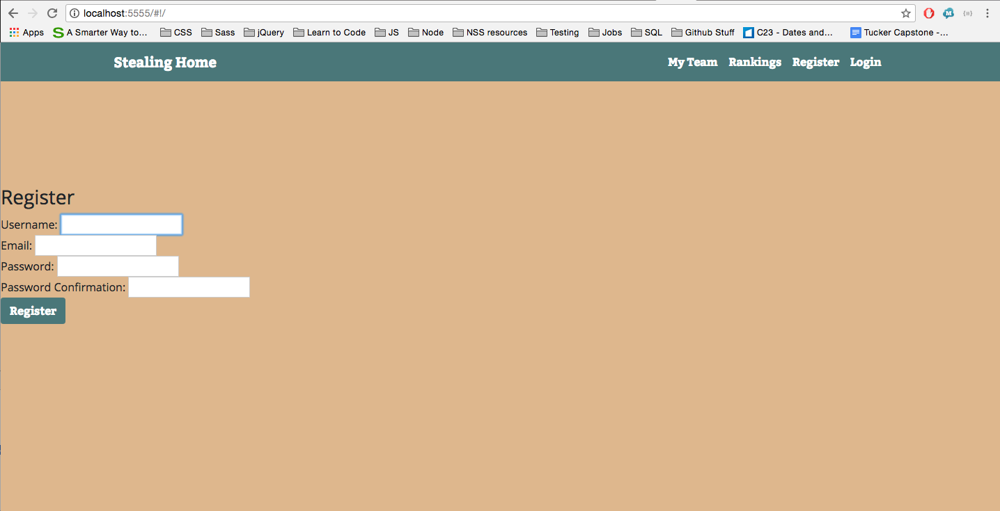
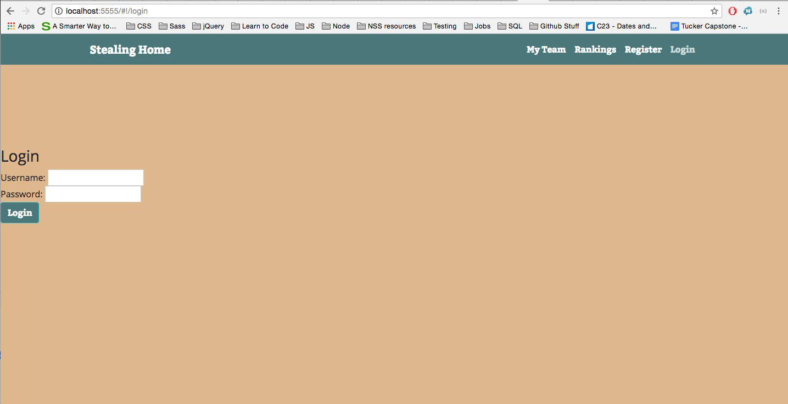
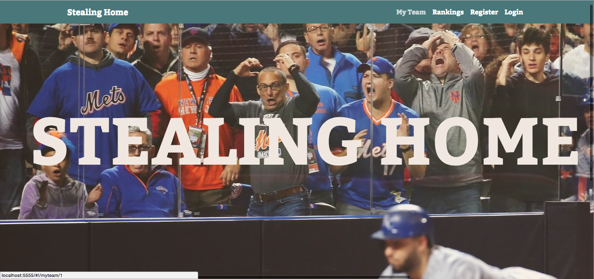
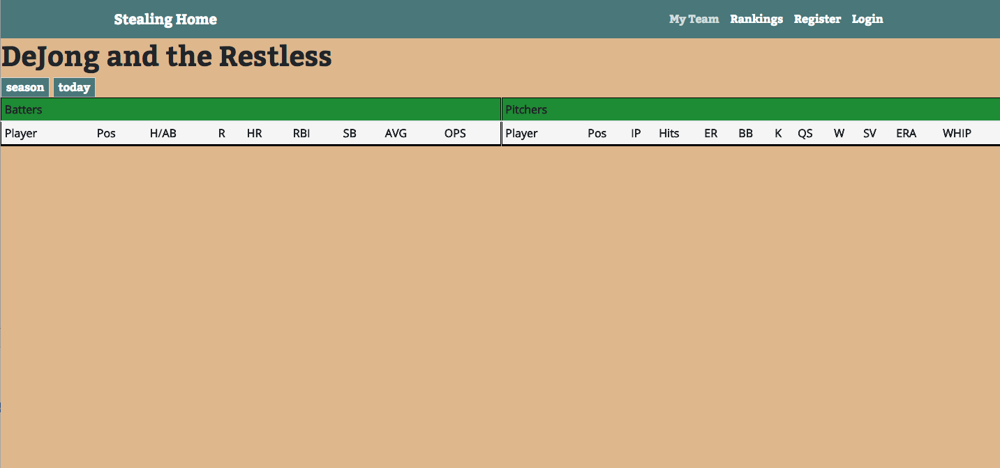
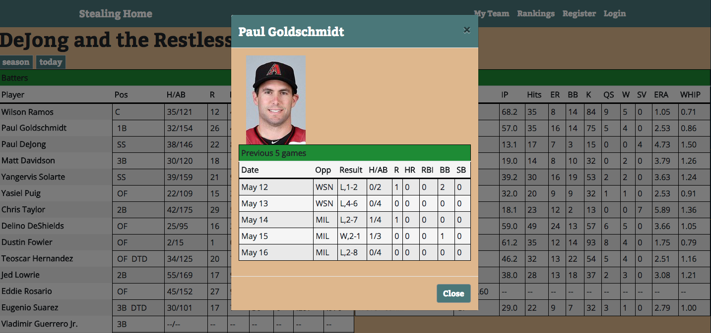
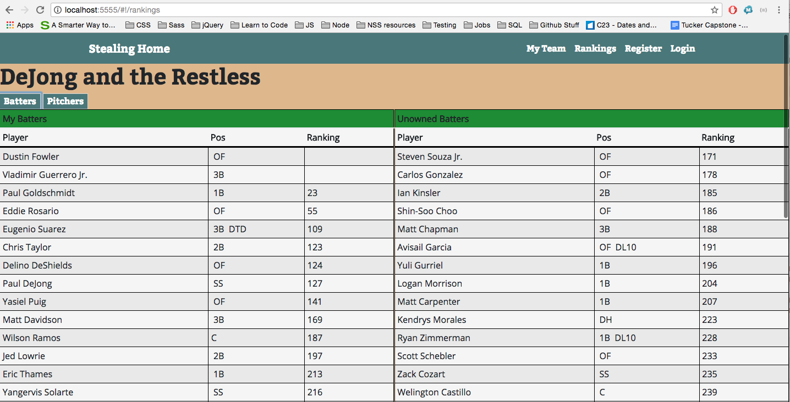

# Back End Capstone: Stealing Home
This is my back-end capstone project for Nashville Software School. This app uses a web-scraper to gather data from ESPN and Baseball Reference based on my fantasy baseball team. Focusing on my specific fantasy baseball league, the data returned includes my team, players available to be added to my team, and the top 300 ESPN rankings for each player.

Each player's data includes their season stats, their current day stats, and the stats of their last five games. This data is collected using a web-scraper that utilizes the Cheerio npm package and NodeJs.

## Getting Started

To Run Locally
```
git clone: https://github.com/EliOJackson/Backend-Capstone.git
```

You will need to make the following install commands at the root of the project:
```
npm install
npm install node sass
```

In a seperate terminal tab, run ```psql``` at the root of folder
Create Database "fantasybb" in postgres
```\c fantasybb``` to open the database
```\d``` to view all tables

Run ```npm run dev``` to begin your server. Visit your local host to access the app.

*Please note in the current iteration, as the first user created in the db, you will be viewing my personal fantasy team's information. If you wish to scrape for your own teams info, you will need to replace the links inside of the individualCtrl, rankingsCtrl, seasonScrapeCtrl, todayScrapeCtrl, and unownedScrapeCtrl.*

Visit ```http://localhost:5555/#!/``` to begin viewing the app (unless you have changed your listening port).

## Registering 

Once visiting the link above you will come to the register page, as seen below. Enter your information to register.



If you have already registered an account, you may select the Login button in the top right and go to the login page.



Once you register/login, you will be brought to the home page. Here you can select My Team or Rankings in the top right Nav Bar.



Once you have selceted My Team, you will have the option to select Batters or Pitchers. Selecting one of these will load the scraped data on to the page.



Selecting a players name once he has been loaded will pop out a modal showing that players last 5 stats. For example, click Paul Goldschmidt.



You may also view rankings by clicking the rankings link in the top right of the navbar. ** Warning. This scrape currently has a long load time. While it may seem like the load is frozen, it does indeed work after an extended period of time (sometimes up to 15 seconds). Thank you for your patience **

Once the page is loaded, you can select batters or pitchers. The left table will be your teams players with their ranks. The right table will be players available to be picked up, with their ranks.




